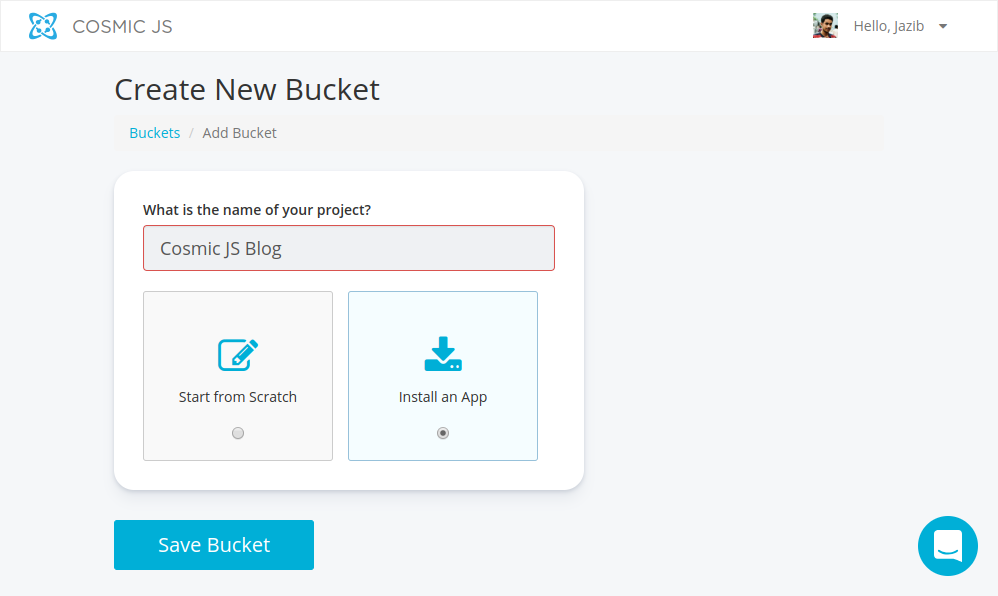
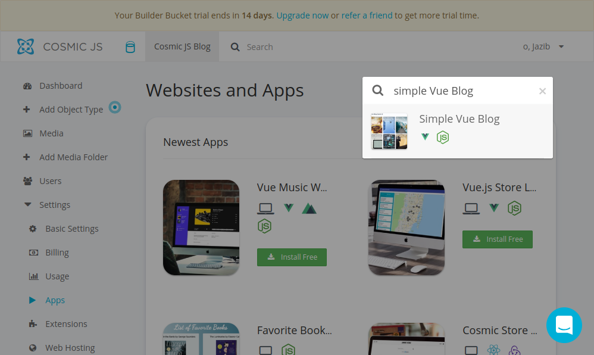
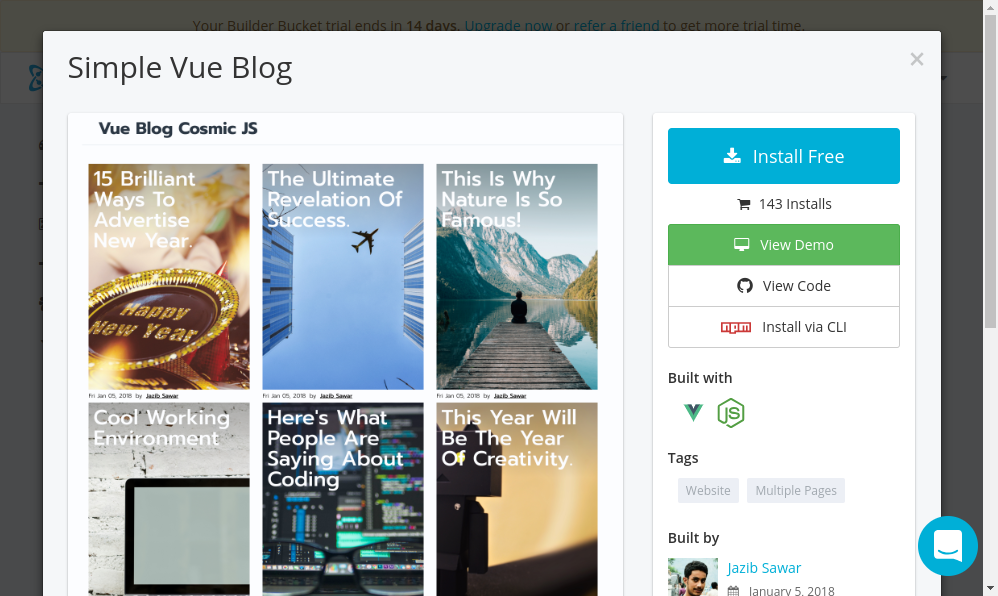
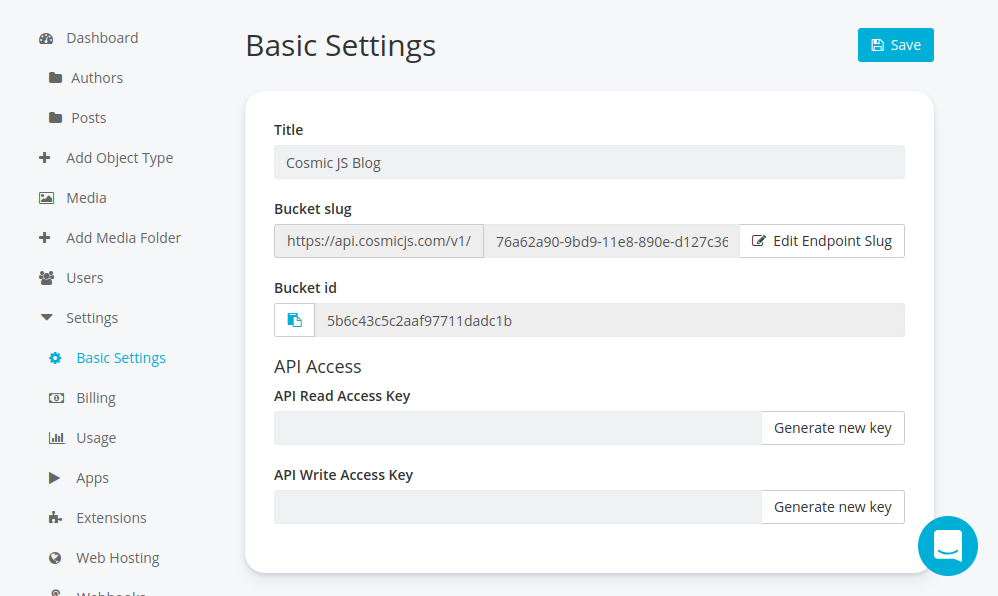
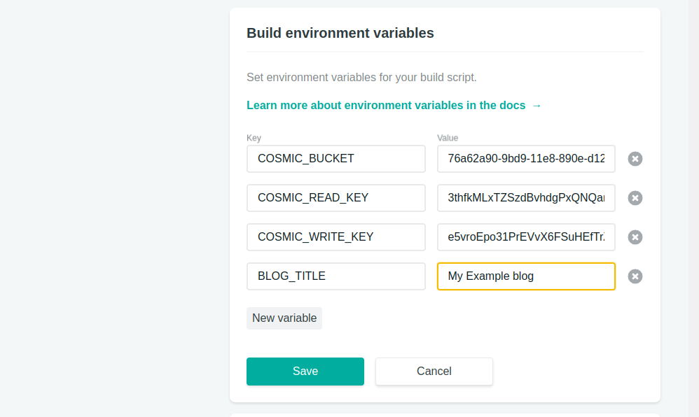
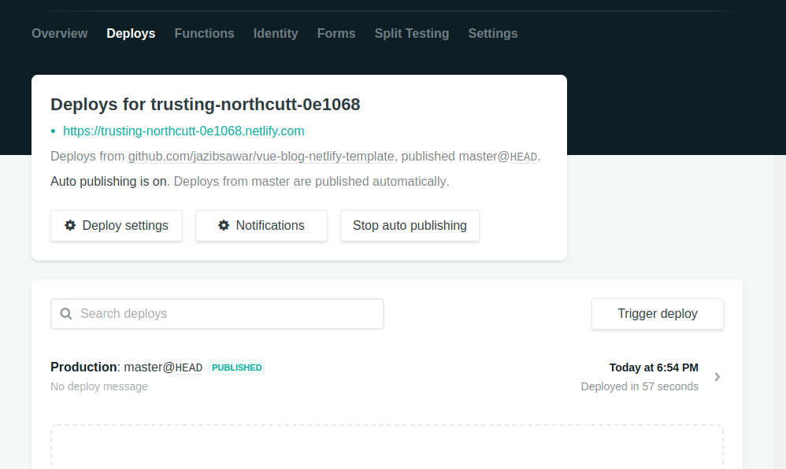

# Vue.js Blog Template Powered by Cosmic JS

A simple Vue.JS template for creating a fast, beautiful blog on Netlify with a continuous deployment workflow and [CosmicJS CMS](https://cosmicjs.com) for content editing.

This template provides blog, blog posts, authors and elegant modern design ready to deploy on [Netlify](http://netlify.com/) with one Click!


> [See live demo hosted on Netlify](https://vue-blog-demo.netlify.com/)

[](https://app.netlify.com/start/deploy?repository=https://github.com/cosmicjs/vue-blog-netlify-template)

## How-to Guide

Below are steps to deploy your application on Netlify and integrate with CosmicJS for content editing.

### 1. Deploy to Netlify

Click on the button below to deploy this application to Netlify. By default, it will be connected to the default CosmicJS bucket.

[](https://app.netlify.com/start/deploy?repository=https://github.com/cosmicjs/vue-blog-netlify-template)

### 2. Create CosmicJS Bucket

Go to [https://cosmicjs.com/add-bucket](https://cosmicjs.com/add-bucket) and provide your `project name`, select `Install App` and then `Save Bucket`.



It will create your CosmicJS bucket and take you to install application page. On this page, enter `"Simple Vue Blog"` in `Search Apps` box.



Click on the result and install the app.



### 3. Generate Credentials

Click on `Settings` and then `Basic Settings` in your bucket dashboard. There you can generate `API Read Access Key` & `API Write Access Key` and save them. This step is optional but recommended for security purposes.



### 4. Add Environment Variable - Netlify

Now go to Netlify Site Settings and then go to the `Build and Deploy` page. Scroll down and you will see `Build environment variables` section where you will enter Cosmic JS Bucket credentials.

```javascript
{
    "COSMIC_BUCKET": "", /* Default: 'simple-vue-blog' */
    "COSMIC_READ_KEY": "", /* Default: ' */
    "COSMIC_WRITE_KEY": "", /* Default: '' */
    "BLOG_TITLE": "", /* Default: 'Vue Blog Cosmic JS' */
}
```



### 5. Redeploy

At last, go to Netlify `Deploys` page and Trigger Deploy. Congratulation, your application is deployed and connected to Cosmic JS bucket.


